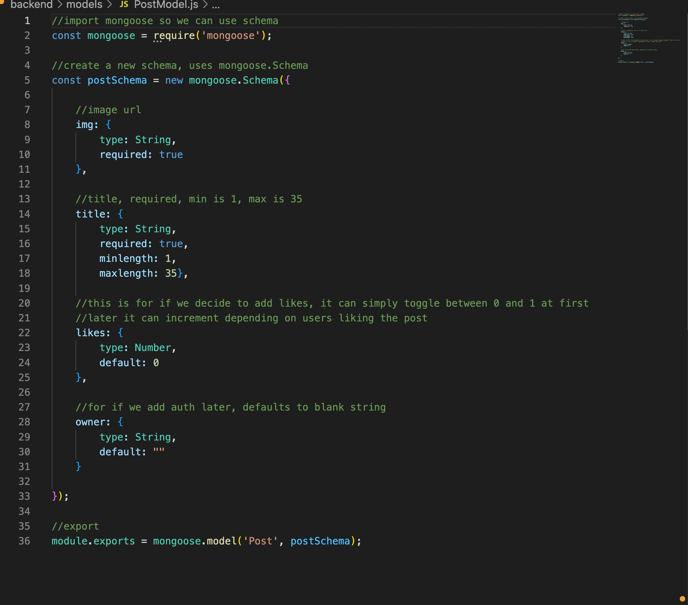

### Backend API

Heroku Deployed [Here](https://isya-project3-pwnterest-api.herokuapp.com/posts)

Frontend Repo [Here](https://github.com/Isyates/pwnterest-project3-frontend)

### List of Dependencies
- Cors
- dotenv
- Express
- Mongoose
- Morgan
### Model

### API Endpoints
|Routes|Method|EndPoints|Expected Result|
|------|:---:|:---:|:----|
|Index|GET|/posts|Gets all posts |
|Create|POST|/posts|Creates new posts |
|Update|PUT|/posts/:id|Updates existing posts |
|Delete|DELETE|/posts/:id|Removes posts from database|